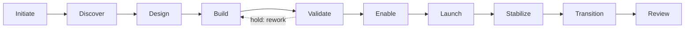
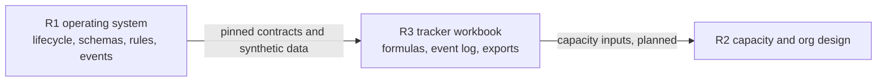

# implementation-operating-system

A vendor-neutral operating system for running software implementation projects: one ten-phase lifecycle, human-recorded gates, deterministic rules, shared data contracts, and a validator. One implementation professional can run it directly from plain files, and a larger team can scale it without changing the model.

> **Status: version 0.1.0, released 2026-10-07 (tag `v0.1.0`).** The core is built and validated against synthetic data. It has not been deployed on a real project, and nothing here reports a historical or measured result.

**Companion repository:** [implementation-tracker-workbook](https://github.com/jmuldroweoi-sys/implementation-tracker-workbook) (R3) runs this model day to day as a macro-free spreadsheet. R1 answers *what operating model implementation work should follow*; R3 answers *how one person can run that model today in a workbook*. R3 copies R1's contracts at a pinned commit and recalculates every R1 rule with formulas that a test suite checks against this repository's rule code.



Each arrow is a gate that a named person records as `pass`, `pass_with_conditions`, or `hold`. Rules calculate, time, and flag; they never decide a gate.

## Purpose

Give implementation work one reliable operating record: which phase each project is in, what must be true to move on, what is late or blocked, which risks and issues matter, how ready a project is to launch, and who decided what. R1 defines that record and the rules around it so that every project is run the same way and every number can be recomputed.

Designed and maintained by Jared Muldrow, an implementation and onboarding professional who runs delivery work hands-on and designs the systems, controls, and tooling around it. That experience informed the design as inspiration only: no employer document, data, or wording is used here.

## Who this is for

- **An implementation or onboarding professional** who runs projects hands-on and wants one lifecycle, one checklist per gate, and one record per project instead of scattered notes.
- **A small implementation team** that needs shared phases, owner roles, and escalation rules without buying or building a large platform.
- **A growing delivery organization** that needs the same records to feed capacity planning, enablement, quality review, and reporting later.

## What problem it solves

Implementation work often lives in a mix of trackers, status notes, and memory. Phases mean different things to different people, gate decisions are not written down, blocked requests wait until someone notices, readiness is a feeling, and every report is rebuilt by hand. R1 replaces that with:

- one lifecycle and one gate checklist per phase, with the outcome always recorded by a named person;
- a request state machine with timers that escalate stalled work to a named role;
- deterministic risk, readiness, and lead-time rules that give the same answer every time;
- an event log that other tools can read without re-keying anything.

## Practical IC use

The full walkthrough is in [docs/practical-workflow.md](docs/practical-workflow.md). It follows Synthetic Project A from intake to review in 17 steps and lists what a solo implementer does each week: update tasks, work the request queue, review risks and issues, check milestones, run the validator, prepare the next gate, and send status. Every step names the record that changes, the rule that applies, the event emitted, and the human decision.

## Architecture

```text
standard/        shared vocabulary for six repositories (1.0.0)
lifecycle/       ten phases and nine gates (core)
schemas/         ten operational record schemas (core)
tools/           r1_rules.py (every rule as a function) and validate.py
config/          request states, SLA, risk, lead-time, and readiness parameters
profiles/        organization stage, complexity, service, and segment profiles
data/synthetic/  three synthetic projects and their events
```

Core, configuration, and optional scenario packs (none installed in 0.1) are separate layers. A named human records every gate outcome, handoff acceptance, and approval; rules only calculate, time, flag, and notify; AI has no authority over any record. See [docs/architecture.md](docs/architecture.md) and [docs/authority-boundaries.md](docs/authority-boundaries.md).

### Where to find things

| You want to | Open |
|---|---|
| Run one project through the model, step by step | [docs/practical-workflow.md](docs/practical-workflow.md) |
| See how the parts fit and who may change what | [docs/architecture.md](docs/architecture.md), [docs/authority-boundaries.md](docs/authority-boundaries.md) |
| Check the rules against worked examples | [verification/deterministic-rules.md](verification/deterministic-rules.md) |
| Check that every synthetic reference resolves | [verification/referential-integrity.md](verification/referential-integrity.md), [verification/synthetic-data-check.md](verification/synthetic-data-check.md) |
| See what was verified for this version | [verification/R1-V0.1-CHECKLIST.md](verification/R1-V0.1-CHECKLIST.md), [verification/STANDARD-1.0.0-CHECKLIST.md](verification/STANDARD-1.0.0-CHECKLIST.md), [verification/release-gate.md](verification/release-gate.md) |
| Propose a change | [CONTRIBUTING.md](CONTRIBUTING.md), [CHANGELOG.md](CHANGELOG.md) |

## Ten-phase lifecycle

1. Initiate
2. Discover
3. Design
4. Build
5. Validate
6. Enable
7. Launch
8. Stabilize
9. Transition
10. Review

Projects move forward one phase at a time after a gate outcome of `pass` or `pass_with_conditions`. The only backward move is Validate to Build for rework. Review has no gate and closes the project. Details: [docs/lifecycle-overview.md](docs/lifecycle-overview.md), [`lifecycle/lifecycle.yaml`](lifecycle/lifecycle.yaml), [`lifecycle/gates.yaml`](lifecycle/gates.yaml).

## Deterministic rules

| Rule | Configuration | Behavior |
|---|---|---|
| Request transitions | `config/request-state-machine.yaml` | 9 statuses, 16 legal transitions; anything else is rejected |
| SLA timers and escalation | `config/sla-rules.yaml` | `due_at` = time entered status + target duration; a stalled request emits `request.escalated` to a named role |
| Risk score | `config/risk-rules.yaml` | likelihood x impact, classified into four bands with a severity |
| Lead-time flags | `config/lead-time-rules.yaml` | flags planned work due too close to a milestone or launch, or starting before its predecessors |
| Readiness | `config/readiness-weights.yaml` | weighted score across six categories plus an incomplete-required-evidence flag |
| Gate checks | `lifecycle/gates.yaml` | yes or no checks that inform, never decide, the gate outcome |

All rules are implemented once in [`tools/r1_rules.py`](tools/r1_rules.py). The validator and the tests call the same functions. No rule uses AI.

## Data model

Ten JSON Schemas in [`schemas/`](schemas/): project (`PRJ`), phase instance (`PHS`), milestone (`MLS`), task (`TSK`), gate assessment (`GAT`), request (`REQ`), handoff (`HND`), risk (`RSK`), issue (`ISS`), and readiness scorecard (`RDS`, with entries `RDE`). IDs, field names, phase keys, statuses, severities, and the event contract come from [`standard/`](standard/README.md). Each schema that has a CSV export lists its exact columns (`x-csv-columns`), which the R3 workbook reuses unchanged.

R1 owns the implementation project, not the customer master. A project carries `customer_reference` (a free-form pointer to the customer record in your own system, never an R1 ID) and `customer_label` (a display label). R1 holds no customer legal, account, billing, contract, HR, or personal data.

## Readiness

The readiness scorecard uses the six canonical categories: people, process, technology, data, training, and support. For each category a person counts the criteria met and confirms whether the required evidence exists. The calculation is fixed:

- `achieved_rate` = criteria met / criteria total
- `category_score` = weight x `achieved_rate`
- `overall_score` = 100 x sum(weight x `achieved_rate`) / sum(weight)
- `incomplete_required_evidence_flag` = true when any category lacks its required evidence

**The score informs the readiness review. It does not make the launch decision.** A named human records the launch gate outcome. A high score with incomplete required evidence is still incomplete: Synthetic Project C scores 91.25 with the flag set, and its launch gate is deliberately unrecorded.

## Scaling

The same model serves startup, early-scale, structured-growth, and mature organizations. Smaller organizations use fewer required fields, lighter gates, and fewer active rules; larger ones add evidence, formal approvers, and stronger audit. The phases, schemas, rules, and human decision points never change. See [docs/scaling-model.md](docs/scaling-model.md).

## Configuration

- [`config/`](config/) holds the rule parameters. Every duration, weight, scale bound, and threshold is labeled as a proposed design value, not a measured result, and as a user-configurable parameter. None is a benchmark.
- [`profiles/`](profiles/) holds the profile schema and four illustrative example profiles. A profile may require extra fields, add gate evidence, make waivable evidence optional, change gate formality, and override listed parameters. It may not redefine the lifecycle, change ID meaning, remove a human approval, or grant AI authority. The validator enforces each limit.

## Synthetic example

[`data/synthetic/`](data/synthetic/README.md) holds synthetic data for three projects: A (startup, simple), B (early scale, with a high risk and a blocked request that is escalated by rule), and C (structured growth, approaching launch, with a rework loop and a launch-review scorecard). Exact counts: 3 projects, 15 phases, 12 milestones, 30 tasks, 8 requests, 6 risks, 5 issues, 18 readiness rows, and 38 events. All references resolve with zero orphans.

## Cross-repo integration

R1 is designed as the authority that five companion repositories build on. One exists today:



R3 implements R1 as a workbook. Planned next: R2 reads task hours, phases, request workload, and launch signals for capacity planning; R4 supplies training evidence; R5 uses R1 records as context only; R6 drafts recommendations that change nothing until a named human approves them. See [docs/portfolio-integration.md](docs/portfolio-integration.md).

## What is not included yet

Planned for later versions, and deliberately absent from 0.1: one file per phase, schemas for decisions, configuration items, environments, promotion records, and improvement items, environment promotion and builder permissions, an integration workstream guide, a detailed continuous-improvement workflow, templates, and the optional large-scale go-live pack (rehearsal plan, cutover runbook, command center, super-user roster, hypercare exit rules). Of the five companion repositories, only R3 is built so far.

## Limitations

- The data is synthetic. Nothing here has been used on a real project, and no value is a measured result.
- SLA timers count elapsed calendar time only; business-hour calendars are not modeled in 0.1.
- Gate assessments and handoffs have schemas and events but no CSV file in the synthetic data set.
- Improvement signals are recorded as the catalog event only until the improvement-item schema exists.
- Event payload fields are named by the catalog and checked for consistency with the records; they are not typed by a separate payload schema.
- The validator proves that the records are internally consistent. It cannot prove that a project is ready; that remains a human decision.

## Public-safety statement

- Industry-neutral, vendor-neutral, and platform-agnostic. No real company, customer, vendor, product, or employer appears anywhere, and the validator checks for common vendor names.
- Examples use neutral labels only (Scenario A to C, Synthetic Project A, Synthetic Organization A, Person A, role IDs). People appear only as `PER-` IDs.
- All data is labeled synthetic data, every example is labeled illustrative example, and every design number is labeled as a proposed design value, not a measured result.
- Everything is freshly written. No source document, training material, or screenshot from any organization is reproduced.

## AI assistance

AI assisted with drafting and structuring this repository: Claude (Anthropic) helped draft text, schemas, configuration, synthetic data, rules, and tests under the author's direction. The author defined the architecture and the rules. Every release is reviewed and approved by the author before it is published, and that review is recorded in [`verification/release-gate.md`](verification/release-gate.md). Every rule and number is also checked by the automated validator and test suite on every commit. AI produced no data about real people or organizations, and no AI is used by any rule in this repository.

## Versioning

| Version | Value |
|---|---|
| Shared standard | 1.0.0 (`standard/version-policy.md`) |
| R1 core record schemas | 0.1.0 (`schema_version` on every record) |
| Readiness calculation | 1.0.0 (`calculation_version` in `config/readiness-weights.yaml`) |
| Repository | 0.1.0, released 2026-10-07, tag `v0.1.0` (`CHANGELOG.md`) |

Validate with Python 3.12:

```bash
python -m pip install -r requirements.txt
python tools/validate.py
python -m unittest discover -s tests -v
```

## License

MIT. See [LICENSE](LICENSE).
